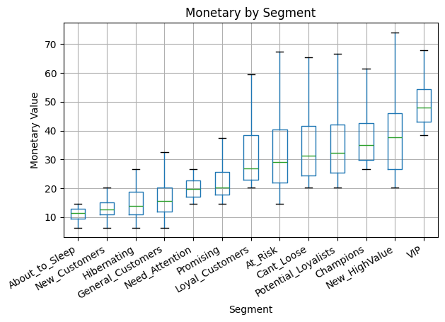
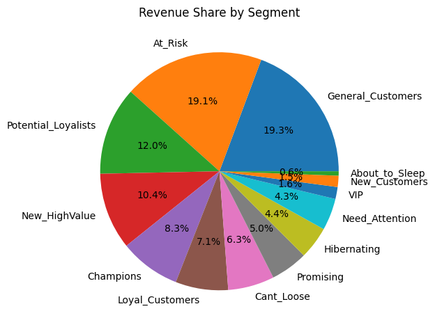
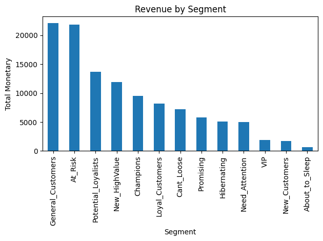

# Customer Segmentation using RFM Analysis

This project demonstrates customer segmentation using the **RFM model (Recency, Frequency, Monetary)** — a powerful method for identifying and analyzing customer behavior patterns.  
The goal is to understand which customer groups bring the most value and how to target them effectively.

---

## 1. Overview

The RFM model divides customers based on:
- **Recency** — how recently a customer made a purchase
- **Frequency** — how often they purchase
- **Monetary** — how much they spend in total

After analysis, customers are grouped into segments such as **Champions, Loyal, At Risk, Hibernating**, and others.  
These insights help businesses focus marketing efforts and improve customer retention.

---

## 2. Project Setup

### Requirements
- Python 3.x
- Jupyter Notebook

### Installation
```bash
git clone https://github.com/arsdmm/RFM-clustering-of-retail.git
cd 
pip install -r requirements.txt
jupyter notebook
```

### Required Libraries
```
pandas==2.2.2
matplotlib==3.9.0
numpy==1.26.4
jupyter==1.0.0
```

---

## 3. Data Preparation

The project uses two datasets — **orders.csv** and **customers.csv** — containing transactional and demographic information about customers.

### orders.csv
- `order_id` — unique order identifier  
- `customer_id` — links the order to a specific customer  
- `order_date` — date of the transaction  
- `revenue` — total amount spent in the order  
- `items_count` — number of products in the order  
- `used_coupon` — whether a discount coupon was used (True/False)  
- `returned` — whether the order was returned (True/False)  
- `channel` — sales channel (e.g., Online, Mobile App, In-Store)

### customers.csv
- `customer_id` — unique customer identifier  
- `gender` — customer’s gender  
- `birth_year` — year of birth (used to estimate age)  
- `city` — city of residence  
- `signup_date` — registration date  
- `source` — customer acquisition source (ads, referral, organic, etc.)

### Cleaning steps:
- Removed duplicates (`drop_duplicates()`)
- Converted date columns (`order_date`, `signup_date`) with `pd.to_datetime()`
- Filled missing revenue by median per channel:
  ```python
  orders['revenue'] = orders.groupby('channel')['revenue'].transform(
      lambda x: x.fillna(x.median())
  )


## 4. RFM Calculation

### Step 1. Define Recency, Frequency, Monetary
```python
cutoff_date = orders['order_date'].max() + pd.Timedelta(days=1)

rfm = orders.groupby('customer_id').agg({
    'order_date': lambda x: (cutoff_date - x.max()).days,
    'order_id': 'count',
    'revenue': 'sum'
}).rename(columns={
    'order_date': 'Recency',
    'order_id': 'Frequency',
    'revenue': 'Monetary'
})
```

### Step 2. Create RFM Scores
```python
rfm['Recency_Score'] = pd.qcut(rfm['Recency'], 5, labels=[5,4,3,2,1])
rfm['Frequency_Score'] = pd.cut(rfm['Frequency'].rank(method='first'), 5, labels=[1,2,3,4,5])
rfm['Monetary_Score'] = pd.qcut(rfm['Monetary'], 5, labels=[1,2,3,4,5])

rfm['RFM_SCORE'] = (
    rfm['Recency_Score'].astype(str) +
    rfm['Frequency_Score'].astype(str) +
    rfm['Monetary_Score'].astype(str)
)
```

---

## 5. Segmentation Logic

Customers were mapped to behavioral categories:

| RFM Score Example |       Segment       |
|-------------------|---------------------|
| 555               | Champions           |
| 444, 545          | Loyal Customers     |
| 343, 244          | Potential Loyalists |
| 155, 122          | At Risk             |
| 111               | Lost Customers      |

---

## 6. Segment Profiling

```python
segment_profile = rfm.groupby('Segment').agg({
    'Recency': 'median',
    'Frequency': 'median',
    'Monetary': 'median',
    'customer_id': 'count'
}).rename(columns={
    'Recency': 'Median_Recency',
    'Frequency': 'Median_Frequency',
    'Monetary': 'Median_Monetary',
    'customer_id': 'Count_customers'
})
```

Revenue share per segment:
```python
segment_profile['Revenue'] = rfm.groupby('Segment')['Monetary'].sum()
segment_profile['Revenue_Share'] = (
    segment_profile['Revenue'] / segment_profile['Revenue'].sum()
)
```

---

## 7. Visualizations

### Boxplot — Monetary by Segment
Shows distribution of customer spending in each segment.



### Pie Chart — Revenue Share by Segment
Displays percentage contribution of each customer group to total revenue.



### Bar Chart — Total Revenue by Segment
Highlights absolute revenue amounts per segment.



---

## 8. Key Insights

- Champions and VIPs spend the most per order but make up a small share of customers.
- General Customers and At Risk segments drive the majority of total revenue.
- New Customers have potential for long-term growth if retention efforts are applied early.
- Hibernating customers can be reactivated through re-engagement campaigns.

---

## 9. Learnings

Through this project, I practiced:
- Data cleaning and handling missing values
- Feature engineering using pandas
- Quantile-based scoring (`qcut` vs `cut`)
- Visual data analysis using Matplotlib
- Business interpretation of RFM segmentation results

---

## 10. Next Steps

- Automate segmentation refresh monthly
- Add dashboard visualization in Power BI or Tableau
- Experiment with KMeans clustering for deeper segmentation
- Extend model to predict customer lifetime value (CLV)

---

## Author

**Dmytro Litvinov**  
LinkedIn: [Dmytro Litvinov](https://www.linkedin.com/in/dmytro-litvinov-2b319b235)

---

## License

This project is released under the MIT License.  
You are free to use, modify, and distribute it with attribution.
